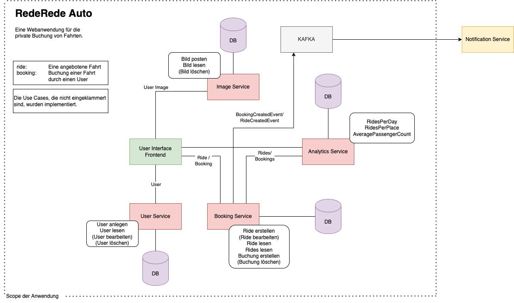
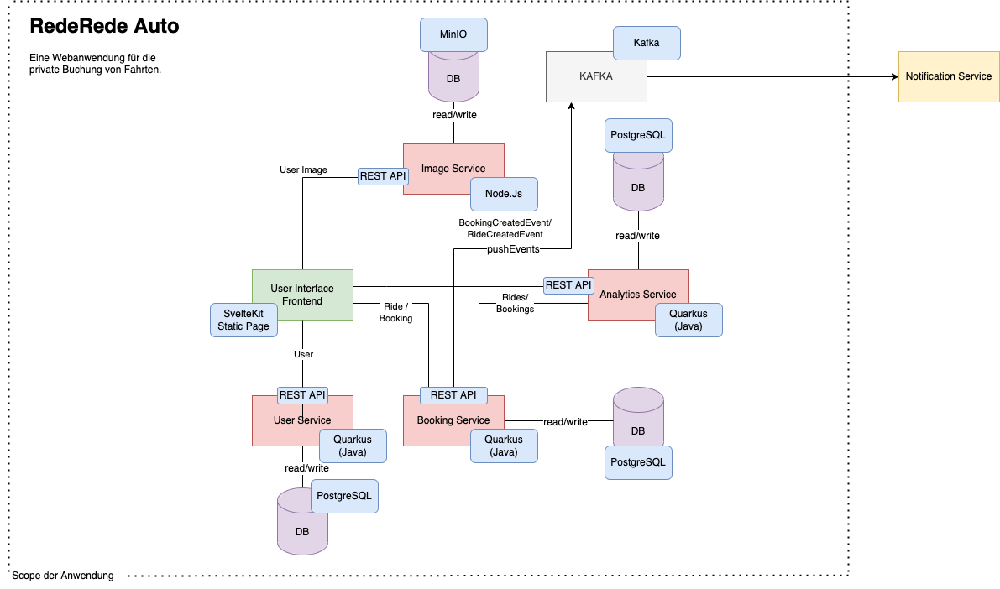
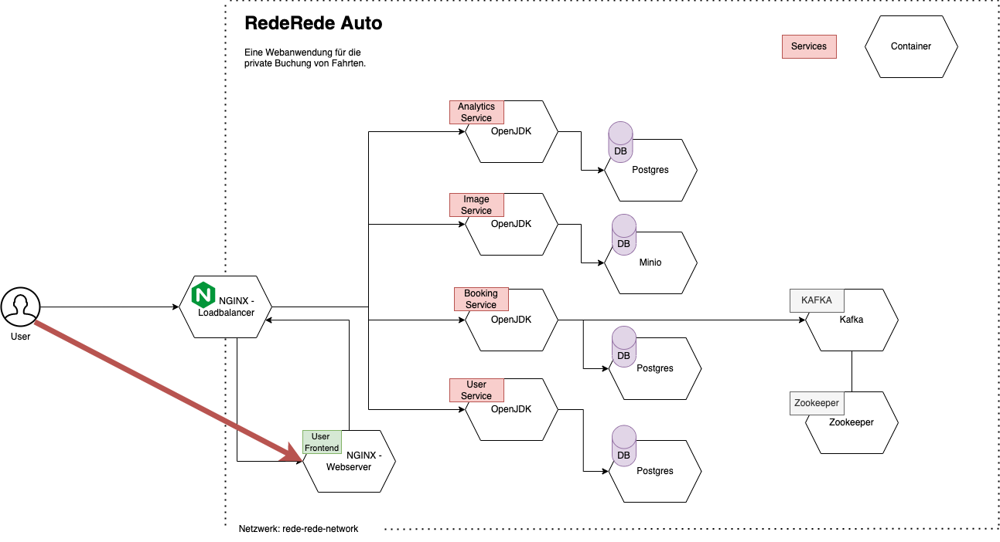
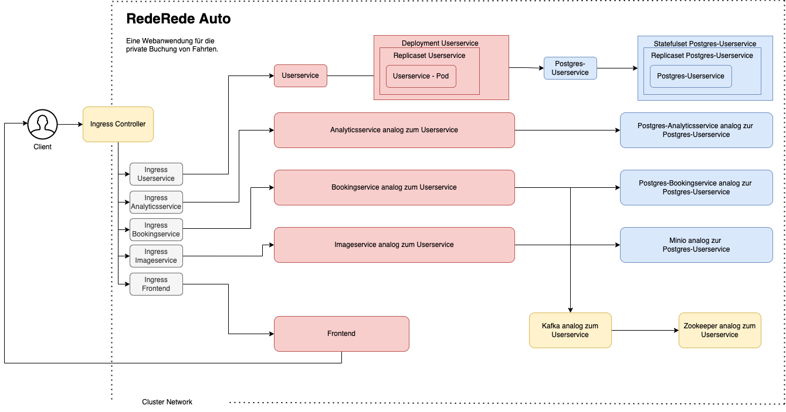

# Architekturen von RedeRede Auto

Unsere Web-Applikation "RedeRede Auto" basiert auf einer Architektur, die verschiedene Perspektiven berücksichtigt, angefangen von einer fachlichen Betrachtung bis hin zu technischen Aspekten und Implementierungsdetails.

### Architektur aus fachlicher Perspektive
Diese Perspektive zeigt die Architektur aus einer geschäftlichen Sicht und stellt alle implementierten Anwendungsfälle dar.

### Architektur zur Beschreibung der Technologien
Diese Perspektive gibt einen Überblick über die Technologien, die in jedem Service unserer Plattform verwendet werden.

### Architektur für Docker-Compose Setup
Hier präsentieren wir eine Architektur für das Docker-Compose-Setup und erklären die Zusammenhänge zwischen den einzelnen Komponenten.

Die Docker-Compose-Architektur veranschaulicht, wie unsere Anwendung in Container verpackt ist und wie diese Container miteinander kommunizieren. Dieses Setup ermöglicht eine einfache Bereitstellung und Skalierung unserer Plattform.

### Architektur für Kubernetes Setup
In dieser Perspektive zeigen wir die Architektur unseres Kubernetes-Setups und erläutern die Beziehungen zwischen den verschiedenen Komponenten.

Die Kubernetes-Architektur verdeutlicht, wie unsere Anwendung in einem Kubernetes-Cluster bereitgestellt und orchestriert wird.

### Innere Architektur des Userservice
Die Architektur beschreibt den inneren Aufbau des Userservices, der nach dem Architekturstil "Hexagonale Architektur" entwicklet wurde.
